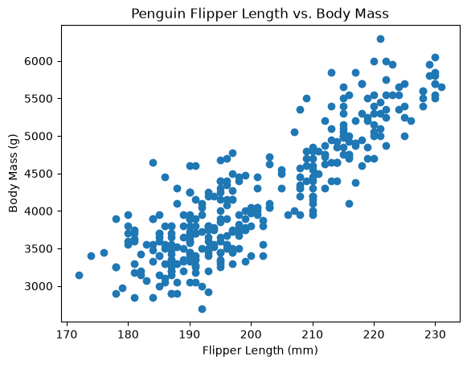
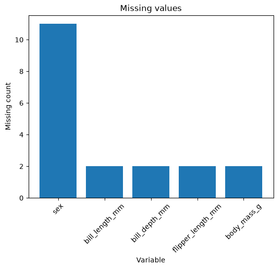

# Project Documentation

> Use this hosted documentation site to tell your
> data story. Include a narrative telling your
> results, observations, and interpretations.
> Display visuals as needed for a compelling story.

## Professional Workflow

See [**Workflow B: Apply Example Project**](https://denisecase.github.io/pro-analytics-02/workflow-b-apply-example-project/)
to get a project like this running on your machine.

## Professional Projects

- We code like the pros to help us **focus on the analytics**.
- Most files in this repository will never be touched.
- If curious about a file, check out the
  [Professional Python Project Explainer](https://denisecase.github.io/professional-python-project-explainer/).

## Documentation Index

- **Home** - this landing page
- [**Project Instructions**](./project-instructions.md)
- [**Concepts**](./concepts.md)
- [**Data Card**](./data-card.md)
- [**API**](./api.md)

## Additional Project Pages

- [**Resources**](./resources.md)
- [**Seaborn Datasets**](./seaborn-datasets.md)
- [**Troubleshooting**](./troubleshooting.md)

## Phase 5: Bill Length and Body Mass by Species

For the final phase of this project, I extended the exploratory data analysis to a new question:

**Does the relationship between bill length and body mass differ by penguin species?**

The analysis showed a positive relationship within all three species:

- Adelie: 0.549
- Chinstrap: 0.514
- Gentoo: 0.669

The relationship was strongest for Gentoo penguins. The scatter plot also showed distinct species groupings, suggesting that species is important when interpreting the relationship between bill length and body mass.

This phase extended the original analysis by comparing the relationship across categories rather than treating all penguins as one group.

## Produced Artifacts

- **Reactive EDA App (marimo)**
- [**Reactive EDA Notebook (marimo)**](https://github.com/lindsaymiller1807/datafun-04-eda/blob/main/src/datafun/notebook.py)
- [**Jupyter Notebook**](https://github.com/lindsaymiller1807/datafun-04-eda/blob/main/notebooks/eda.ipynb)

## Initial Results

